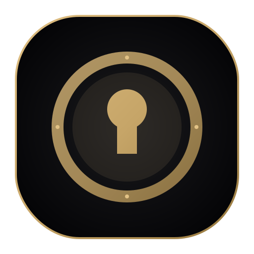

#  LyricVault v0.3.1

## The Ultimate Local Music Sanctuary — Powered by AI

---

## ✨ What is LyricVault?

**LyricVault** is a reimagined music player for the modern audiophile. It combines a local-first philosophy with the power of generative AI to ensure your music library is beautiful, complete, and fully yours.

Stop relying on streaming services that change metadata or remove tracks. Build your **sanctuary**.

---

## 🚀 New in v0.3.0

### 🧠 AI & Model Controls

- **Model Selector**: Choose Gemini Flash / Pro / Lite with performance badges directly from Settings.
- **Multimodal Transcription**: Audio-to-lyrics path is now standard and can fall back after web research.
- **API Key Tester**: Validate your Gemini key before saving.

### 🔒 Reliability

- **Thread-Safe Tasks**: Background ingest/research wrapped with locks to prevent races.
- **Smart Retries**: 500/503 + rate limits now use exponential backoff.
- **Dynamic FFmpeg Discovery**: Finds WinGet/system FFmpeg automatically.

### 🎨 Space Bass UI

- **Updated Settings 2.0** with Monet-inspired layout.
- **Glassmorphism + Gold accents** standardized across views.
- **Icon pipeline** in `scripts/` for consistent app icons.

### 🧹 Housekeeping

- Centralized `API_BASE` config; removed unused deps (`beautifulsoup4`, `spotipy`).

---

## 🎨 The Aesthetic: "Space Bass"

Inspired by the Google Pixel 10 Pro and deep house vibes:

- **Glassmorphism**: High-blur, translucent panels.
- **Gold Accents**: Signature `#E2C286` highlights against a deep void background.
- **Fluid Motion**: Animations that breathe with the music.

---

## 🛠️ Tech Stack

| Core | Technology |
| :--- | :--- |
| **Frontend** | React 19 + Vite + Tailwind v4 |
| **Backend** | Python FastAPI + SQLAlchemy |
| **AI** | Google Gemini 2.0 Flash (Stable) |
| **Audio** | yt-dlp + FFmpeg (Auto-managed) |
| **Shell** | Electron 35 |

---

## 🚦 Getting Started

### 1. Installation

Grab the latest release from the `releases` folder or build it yourself.

**Option A: Installer**
Run `LyricVault Setup 0.3.0.exe` to install to your system.

**Option B: Portable**
Run `LyricVault 0.3.0.exe` to launch instantly.

### 2. Configuration

To enable AI features:

1. Go to **Settings**.
2. Enter your [Google Gemini API Key](https://aistudio.google.com/).
3. Select **Gemini 2.0 Flash** (Recommended).

---

## 🤝 Contributing

We welcome fellow audiophiles and coders!

1. Fork the repo.
2. `npm run setup:python` to initialize the backend.
3. `npm run dev` to launch the development environment.

---

> *Created with ❤️ by McEveritts.*
